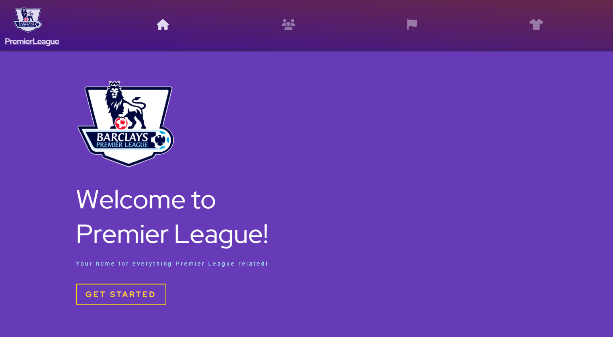

# PremierLeague

PremierLeague is a comprehensive project designed to scrape match statistics for over 700 players, manipulate and present the data dynamically. The project is divided into four main components: Backend and Frontend.

  
## Features

- **Backend**: Dynamic manipulation and presentation of the scraped data through a Spring Boot application.
- **Database**: Real-time data manipulation within a Postgres database using SQL queries.
- **Frontend**: Seamless integration with a user-friendly ReactJS interface.

